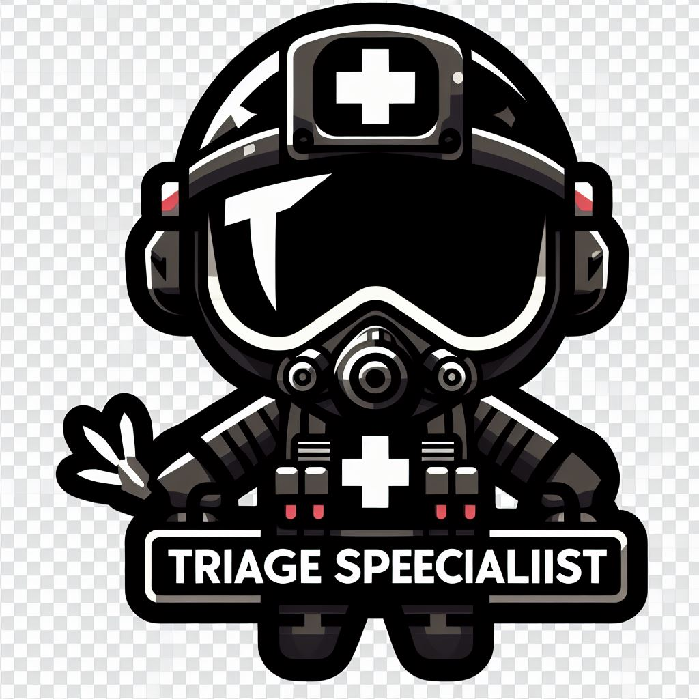
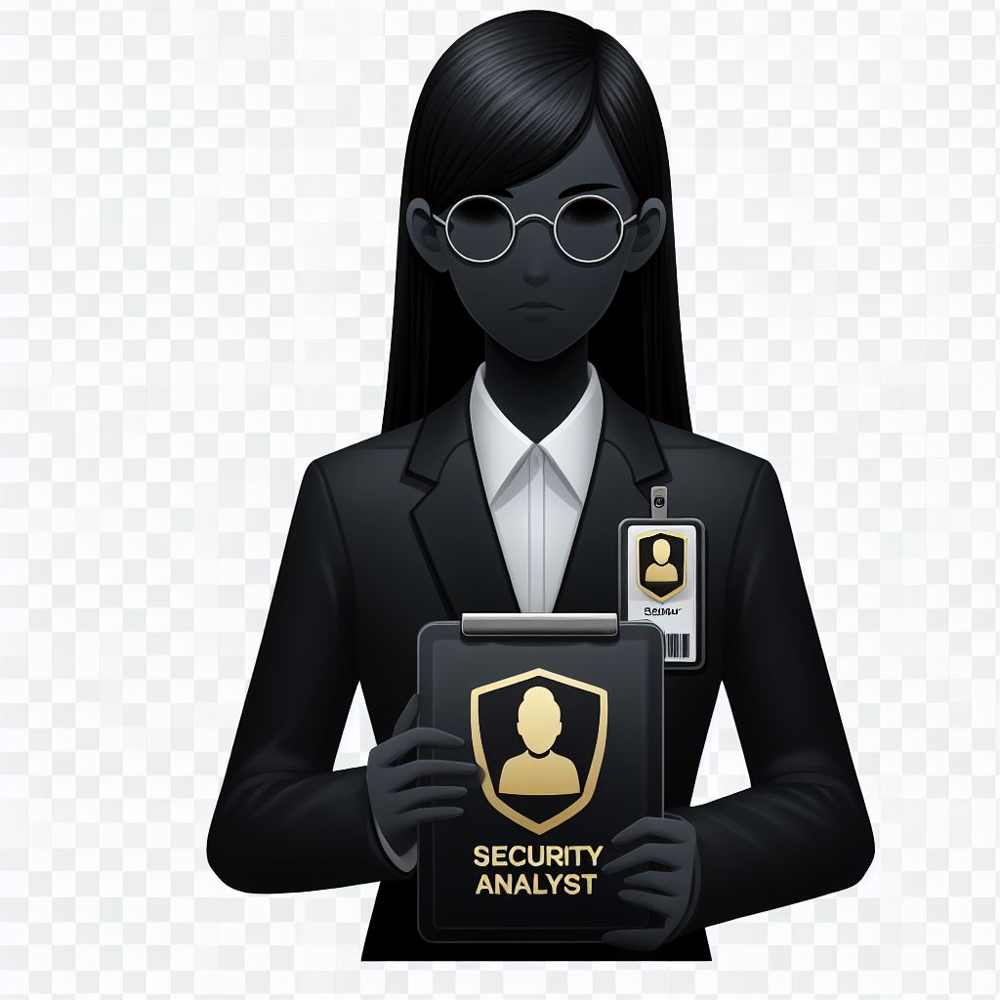
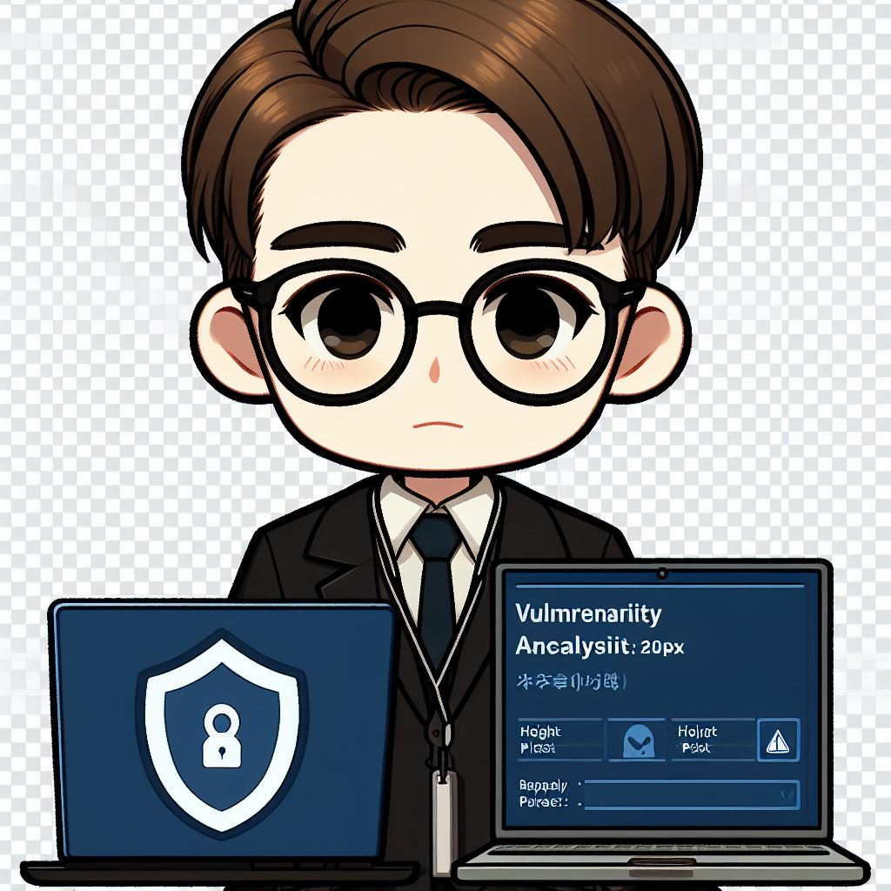

# Communicative Agents for Security Operations

  

## 📖 Overview

- **CyberCrew** [notebook] pretends to become a **virtual cybersecurity operations center** that operates through various **intelligent agents**.
  different roles, including SOC Manager , Triage Specialist , Senior Security Analyst , Threat Intelligence Specialist . These
  agents form a multi-agent organizational structure and are united by a mission to "Autonomously analyze security events."
- The primary objective of CyberCrew is to offer a complete zero human intervention in the process of analyzing security alerts within a SOC we tend to build an **easy-to-use**, **highly customizable** and **extendable** framework, built on top of CrewAI
  which is supported by large language models (LLMs).

## 🤝 Acknowledgments

- ChatDev
- CrewAI
- Sam Witteveen

## 📬 Contact

If you have any questions, feedback, or would like to complain about any break of rights, please feel free to reach out.
